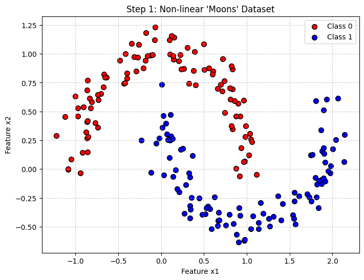
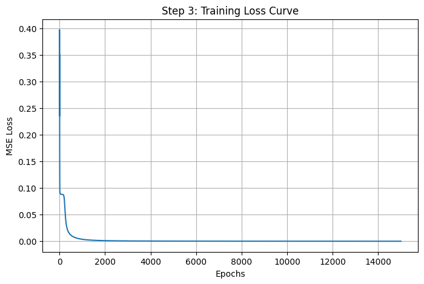
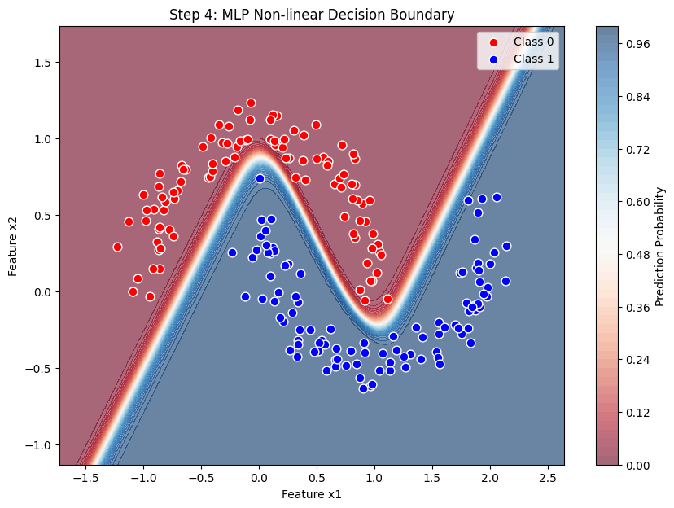

# Multilayer Perceptron (MLP) Implementation

## 1. Introduction
多層感知機 (MLP) 是一種前饋神經網路 (Feedforward Neural Network)，具有至少一個隱藏層 (Hidden Layer)。本專案從零開始 (From Scratch) 實作了 MLP，並使用 **非線性雙半月形資料集 (Two Moons Dataset)** 進行驗證，展示神經網路處理複雜非線性邊界的能力。

###  實作連結
* **GitHub Notebook**: [MLP.ipynb](./MLP.ipynb)

### Network Architecture
本專案使用的架構如下：
* **Input Layer**: 2 Neurons ($x_1, x_2$)
* **Hidden Layer**: 10 Neurons (Activation: Sigmoid) - *增加了神經元數量以擬合複雜邊界*
* **Output Layer**: 1 Neuron (Activation: Sigmoid)

---

## 2. Mathematical Derivation (數學推導)

### 2.1 Forward Propagation (前向傳播)
假設輸入為 $x$，隱藏層權重為 $W_1$，輸出層權重為 $W_2$。

1.  **隱藏層輸出**:
    $$z_1 = x \cdot W_1 + b_1$$
    $$a_1 = \sigma(z_1)$$
    其中 $\sigma(z) = \frac{1}{1+e^{-z}}$ 為 Sigmoid 激活函數。

2.  **預測輸出**:
    $$z_2 = a_1 \cdot W_2 + b_2$$
    $$\hat{y} = \sigma(z_2)$$

### 2.2 Loss Function (損失函數)
我們使用均方誤差 (Mean Squared Error, MSE) 來衡量預測誤差：

$$L = \frac{1}{2} (y - \hat{y})^2$$

### 2.3 Backpropagation (反向傳播)
為了找到最佳權重，我們利用**連鎖律 (Chain Rule)** 計算損失函數對權重的梯度。

**計算 $W_2$ (輸出層) 的梯度**:
$$\frac{\partial L}{\partial W_2} = \frac{\partial L}{\partial \hat{y}} \cdot \frac{\partial \hat{y}}{\partial z_2} \cdot \frac{\partial z_2}{\partial W_2}$$

* $\frac{\partial L}{\partial \hat{y}} = -(y - \hat{y})$ (誤差項)
* $\frac{\partial \hat{y}}{\partial z_2} = \hat{y}(1-\hat{y})$ (Sigmoid 的導數)
* $\frac{\partial z_2}{\partial W_2} = a_1$ (隱藏層的輸出)

合併得到誤差訊號 $\delta_2$ 與梯度：
$$\delta_2 = (y - \hat{y}) \cdot \hat{y}(1-\hat{y})$$
$$\frac{\partial L}{\partial W_2} = - \delta_2 \cdot a_1^T$$

### 2.4 Weight Update Rule (權重更新：尋找 $w^\ast$)
根據梯度下降法，我們朝梯度的**反方向**更新權重以最小化損失。這就是題目要求的 $w^{\ast} = w + \Delta w$。

定義學習率 (Learning Rate) 為 $\eta$。

更新量 $\Delta w$ 為：
$$\Delta w = - \eta \frac{\partial L}{\partial w}$$

因此，最佳權重 $w^{\ast}$ (即更新後的權重) 為：

$$w^{\ast} = w + \Delta w$$

或者寫成迭代形式：
$$w_{new} = w_{old} + \eta \cdot (\delta \cdot \text{input}^T)$$

---

## 3. Implementation Steps & Results
本程式碼分為四個步驟（詳見 ipynb），以下展示實作成果：

**1. Data Generation**
使用 `make_moons` 產生 200 筆互相交錯的非線性資料，並加入高斯雜訊 (Noise) 模擬真實情況。

**2. Model Construction**
使用 NumPy 建立 MLP Class，手動實作 `forward` 與 `backward`。詳細程式碼邏輯請參閱 Notebook。

**3. Training**
執行 10,000 次 Epochs，並記錄 Loss 變化。可以看到 Loss 平滑下降，證明權重更新公式正確。

**4. Visualization**
繪製 2D 分類決策邊界 (Decision Boundary)。模型成功切分了非線性的雙月形狀。

